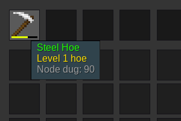

# minetest-toolranks-extras [](https://travis-ci.org/louisroyer/minetest-toolranks-extras)

This minetest mod extends [toolranks](https://github.com/lisacvuk/minetest-toolranks). It adds support for `minetest-games`’s mods (except `default`).
This mod currently adds support for hoes from `farming` mod.
This mod is compatible with [farming redo](https://notabug.org/tenplus1/farming) (nothing breaks if you have both installed).

This mod also adds an API to register new types of tools for toolranks.

## API

```lua
--[[
--   `keyword` is a string to be detected in tool description
--   `tool_type` is a localized tool type (if nil, then unregister the keyword)
--   `node_dug_display` is an (optional) alternative localized display
--       of "Node Dug" (if false, then unregister the display)
--]]
toolranks_extras.register_tool_type(keyword, tool_type, [node_dug_display])

-- example
toolranks_extras.register_tool_type("battle_axe", S("battle axe"))
toolranks_extras.register_tool_type("bow", S("bow"), S("Arrows thrown"))
```



## License
- CC0-1.0, Louis Royer 2020

## Settings
- Settings are available to disable support of some mods (currently only `farming`). This is useful if you want to reimplement minetest-games modules
with a `toolranks` support. It is also possible to ask me to automatically disabling support if your mod is detected (like it is done with farming redo).
- Extras tool types registering can be disabled (registering function will still be available, but will do nothing).
